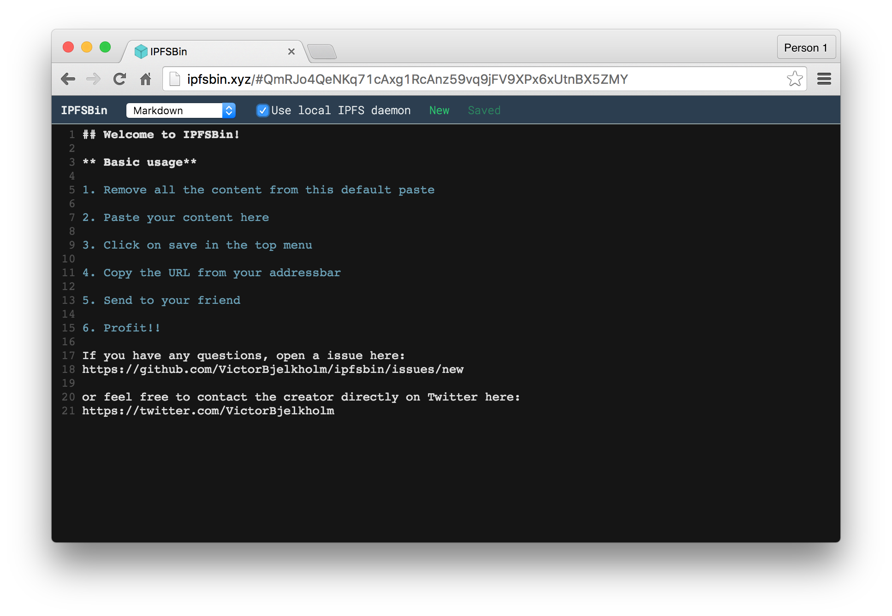

## IPFSBIN



IPFSBIN is a pastebin application for sharing code and text documents to other people. It supports 81 languages and works even if you don't have access to the internet anymore.

When you first load the application, we download and store everything in the browser. Therefore a connection is not required to use IPFSBIN after the initial load.

### Basic Usage

1. Navigate to ipfsbin.xyz

2. Remove the content already visible and paste your own content

3. Click on save in the top right

4. Copy the new URL from your addressbar

5. Send to your friend

6. Profit!!

### Support

If you have any questions, open a Github issue here:
[github.com/VictorBjelkholm/ipfsbin/issues/new](https://github.com/VictorBjelkholm/ipfsbin/issues/new)

or feel free to contact me on Twitter here:
[@VictorBjelkholm](https://twitter.com/VictorBjelkholm)

### Requirements for offline usage

* Already running IPFS daemon [IPFS Homepage](https://ipfs.io)
	* (Run with `API_ORIGIN="*" ipfs daemon` to allow IPFSBIN access to the local IPFS API) 
* Webserver of choice, (python sample provided)

### Running offline

**Browser cached copy** Visit [ipfsbin.xyz](http://ipfsbin.xyz) in your favorite browser, and you have installed IPFSBIN in that browser. If you clear the browser cache, you might lose it and it has to be cached again by being online. If an update have been released and you're online, it will be installed when you reload the page. If you're offline, the old version will still work.

**Offline:** You can also run the application locally by cloning the project and start webserver of choice, serving the root folder. `python -m SimpleHTTPServer` is a handy command for serving from current folder.

```shell
git clone https://github.com/VictorBjelkholm/ipfsbin.git
cd ipfsbin
npm install
npm run compile # only needed on creation/update
python -m SimpleHTTPServer
```

Visit [localhost:8000](http://localhost:8000/) to navigate to IPFSBIN. Add a `?local` ( [localhost:8000/?local](http://localhost:8000/?local) ) in the end to start directly in local mode.

### Hacking / Contributing

You wish to contribute a feature or fix an annoying bug? Follow the instructions about running offline, but instead of `npm run compile`, run `npm run dev` and go to (localhost:3000)[localhost:3000]. When in dev mode, it automatically uses your local IPFS daemon so make sure it's running.

### License

The MIT License (MIT)

Copyright (c) 2015 Victor Bjelkholm

Permission is hereby granted, free of charge, to any person obtaining a copy
of this software and associated documentation files (the "Software"), to deal
in the Software without restriction, including without limitation the rights
to use, copy, modify, merge, publish, distribute, sublicense, and/or sell
copies of the Software, and to permit persons to whom the Software is
furnished to do so, subject to the following conditions:

The above copyright notice and this permission notice shall be included in all
copies or substantial portions of the Software.

THE SOFTWARE IS PROVIDED "AS IS", WITHOUT WARRANTY OF ANY KIND, EXPRESS OR
IMPLIED, INCLUDING BUT NOT LIMITED TO THE WARRANTIES OF MERCHANTABILITY,
FITNESS FOR A PARTICULAR PURPOSE AND NONINFRINGEMENT. IN NO EVENT SHALL THE
AUTHORS OR COPYRIGHT HOLDERS BE LIABLE FOR ANY CLAIM, DAMAGES OR OTHER
LIABILITY, WHETHER IN AN ACTION OF CONTRACT, TORT OR OTHERWISE, ARISING FROM,
OUT OF OR IN CONNECTION WITH THE SOFTWARE OR THE USE OR OTHER DEALINGS IN THE
SOFTWARE.
